# ml-guppy-lab
# 🐟 The ML Guppy

**Swimming through Machine Learning, one tiny project at a time.**

---

## 🌊 About This Journey

I'm a Software Engineer, currently navigating the vast ocean of Machine Learning and AI. This repository documents my **public learning journey** through small, practical, and sometimes funny ML projects.

### Why "The ML Guppie"?
- 🐟 **Guppy**: A small fish in a big ocean (ML field)
- 📚 **Learning in Public**: Documenting the messy, real process
- 🎯 **Tiny Projects**: Bite-sized, weekly projects that reinforce concepts
- 🔄 **From .NET to Neural Nets**: Transitioning from backend engineering to ML

---

## 🌊 My Current Skill Graph

```mermaid
flowchart TD
    Root((The ML Guppy 🐟)) 

    %% Main Branches
    Python[Python Core]
    CV[Computer Vision 🔥]
    GenAI[Generative AI & LLMs]
    ML[ML & Data Science]
    Audio[Audio & Sonification 🎵]
    Viz[Creative Viz & Art 🎨]
    FullStack[Full-Stack Magic]
    Super[Superpower]

    Root --> Python
    Root --> CV
    Root --> GenAI
    Root --> ML
    Root --> Audio
    Root --> Viz
    Root --> FullStack
    Root --> Super

    %% Sub skills
    Python --> NumPy["NumPy + Pandas"]
    Python --> FastAPI["FastAPI Backend"]
    Python --> Venv["Requirements & venv"]

    CV --> OpenCV["OpenCV (real-time)"]
    CV --> MediaPipe["MediaPipe (hands + face)"]
    CV --> Gesture["Gesture Recognition"]
    CV --> Particles["Particle Systems"]
    CV --> AR["AR Effects<br/>(origami, AuraHands, fire_writing)"]

    GenAI --> Llama["Llama 3.1 (BumDerHinge)"]
    GenAI --> DeepSeek["DeepSeek + API"]
    GenAI --> SD["Stable Diffusion (memes)"]
    GenAI --> HF["HuggingFace + PyTorch"]

    ML --> Scikit["scikit-learn (recsys + anomalies)"]
    ML --> Isolation["IsolationForest"]
    ML --> Cosine["Cosine Similarity"]
    ML --> TF["TensorFlow/Keras contours"]

    Audio --> Librosa["librosa (pitch + amplitude)"]
    Audio --> MIDI["MIDI + pyfluidsynth"]
    Audio --> Vocal["Voice → Art (vocal_painting)"]
    Audio --> Nvidia["Stock → Music (Nvidia)"]

    Viz --> Matplot["Matplotlib Animations (cat parade!)"]
    Viz --> Plotly["Plotly + Wavesurfer"]
    Viz --> Perlin["Perlin Noise (cosmic-starfield)"]
    Viz --> Color["Color Extraction"]

    FullStack --> React["React + Vite Frontend"]
    FullStack --> API["API Design"]
    FullStack --> Dating["Dating App Parodies"]

    Super --> Reels["Funny IG Reels (@themlguppy)"]
    Super --> Journey["From .NET → AI in ~4 months"]
```

---

## 🗺️ Learning Roadmap
1. Foundations (NumPy, Pandas, Visualization)
2. Core ML Algorithms (Supervised Learning)
3. Unsupervised Learning & Deep Learning
4. MLOps & Production Deployment

---

## 🎯 Goals
- Build 52 ML projects in 1 year
- Document the complete learning process
- Create a portfolio that bridges corporate experience with ML skills
- Help others by sharing resources and struggles

---

## 📬 Connect
Follow the journey:
- 🐦 Twitter/X: [@TheMLGuppie](#)
- 📹 YouTube: [@TheMLGuppie](#)
- 📸 Instagram: [@the.ml.guppie](#)
- 💼 LinkedIn: [Your Name](#)

---

## 📝 License
This repository is for educational purposes. Code is MIT Licensed unless otherwise specified.

---

*"A guppy today, a shark tomorrow. Keep swimming!"* 🐟
